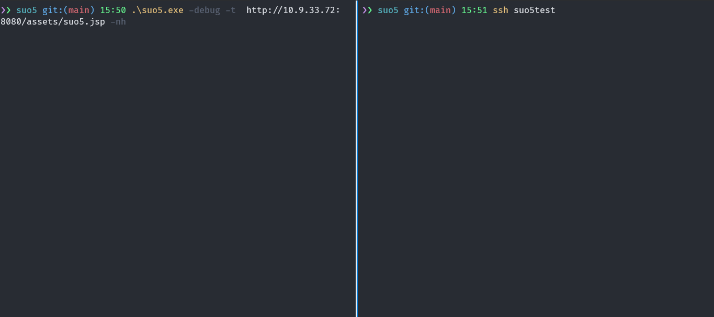

<h1 align="center">Suo5</h1>

<p align="center">A high-performance http proxy tunneling tool</p>

<div align="center">


</div>



[中文](./README.md) | [English](./README_EN.md)

----

`suo5` is a new HTTP proxy tunnel built on the `Chunked-Encoding` of `HTTP/1.1`.
Compared to traditional tunneling tools like [Neo-reGeorg](https://github.com/L-codes/Neo-reGeorg),
`suo5` offers performance that is several times higher. Check out the [performance tests](./tests)

Its key features include:

- Simultaneously supports full duplex and half duplex modes, with transmission performance similar to FRP.
- Supports usage in Nginx reverse proxy and load balancing scenarios.
- Perfect connection control and concurrency management for smooth and seamless usage.
- Supports common middleware such as Tomcat, Jetty, Weblogic, WebSphere, Resin, etc.
- Supports all versions of Java4 to Java 19.
- Provides both command line and graphical interfaces simultaneously.
 
The principle: [https://koalr.me/posts/suo5-a-hign-performace-http-socks/](https://koalr.me/posts/suo5-a-hign-performace-http-socks/)

## Install and run

Go to [Releases](https://github.com/zema1/suo5/releases) to download the compiled binary, where the version with `gui`
is the GUI version and the one without `gui` is the command line version. All compilations are automatically built by
Github Action, feel free to use them.

To use it, you need to upload [suo5.jsp](. /assets/) to the target server and make sure it is runnable.

### GUI App

The GUI version is based on [wails](https://github.com/wailsapp/wails) which relies on the Webview2 framework.
Windows 11 and MacOS already come with this component, other systems will have a popup box to download and install it.


### Command line

```text
USAGE:
   suo5 [global options] command [command options] [arguments...]

VERSION:
   v0.9.0

COMMANDS:
   help, h  Shows a list of commands or help for one command

GLOBAL OPTIONS:
   --target value, -t value                               set the remote server url, ex: http://localhost:8080/tomcat_debug_war_exploded/
   --listen value, -l value                               set the listen address of socks5 server (default: "127.0.0.1:1111")
   --method value, -m value                               http request method (default: "POST")
   --redirect value, -r value                             redirect to the url if host not matched, used to bypass load balance
   --no-auth                                              disable socks5 authentication (default: true)
   --auth value                                           socks5 creds, username:password, leave empty to auto generate
   --mode value                                           connection mode, choices are auto, full, half (default: "auto")
   --ua value                                             the user-agent used to send request (default: "Mozilla/5.0 (Linux; Android 6.0; Nexus 5 Build/MRA58N) AppleWebKit/537.36 (KHTML, like Gecko) Chrome/109.1.2.3")
   --header value, -H value [ --header value, -H value ]  use extra header, ex -H 'Cookie: abc'
   --timeout value                                        http request timeout in seconds (default: 10)
   --buf-size value                                       set the request max body size (default: 327680)
   --proxy value                                          use upstream proxy, support both socks5 and http(s), eg: socks5://127.0.0.1:7890
   --debug, -d                                            debug the traffic, print more details (default: false)
   --no-heartbeat, --nh                                   disable heartbeat to the remote server which will send data every 5s (default: false)
   --no-gzip, --ng                                        disable gzip compression, which will improve compatibility with some old servers (default: false)
   --help, -h                                             show help
   --version, -v                                          print the version
```

The command line version is exactly the same as the GUI version, You can refer to the GUI version to use it. The
simplest use is to simply specify the connection target.

```bash
$ ./suo5 -t https://example.com/proxy.jsp
```

Sending requests using the ``GET`` method which sometimes can bypass restrictions

```bash
$ ./suo5 -m GET -t https://example.com/proxy.jsp
```

set the socks5 server listen on `0.0.0.0:7788` and set the authentication to `test:test123`

```bash
$ ./suo5 -t https://example.com/proxy.jsp -l 0.0.0.0:7788 --auth test:test123
```

### Notice

The `User-Agent` (`ua`) configuration is bound to the server side, if you modify one of them, the other one must be
modified to connect as well.

## Frequently Asked Questions

1. What is full-duplex and half-duplex?

   **Full-duplex** An HTTP tunnel can be constructed by sending a single HTTP request, enabling bi-directional communication over TCP. This request can be interpreted as both an upload and a download request, it will keep downloading and uploading, so it can be used for bi-directional communication.

   **Half-duplex** In some scenarios where `full-duplex` mode is not supported (e.g., there is a reverse proxy),
   it will fall back to half-duplex mode, send a request to build a downstream tunnel, and use the general http request to send upstream data.

2. `suo5` vs `Neo-reGeorg`?

   If the target is a Java-based website, in most cases, `suo5` is more stable and faster than `neo`. However, `neo` provides a wide range of server-side support, good compatibility, and also supports some features that `suo5` is still developing. Additionally, `neo` also supports more flexible customization.

## Next

- [x] support for configuring upstream socks proxy
- [x] Support load balancing scenarios
- [ ] Support for .net

## Reference

- [https://github.com/L-codes/Neo-reGeorg](https://github.com/L-codes/Neo-reGeorg)
- [https://github.com/BeichenDream/Chunk-Proxy](https://github.com/BeichenDream/Chunk-Proxy)